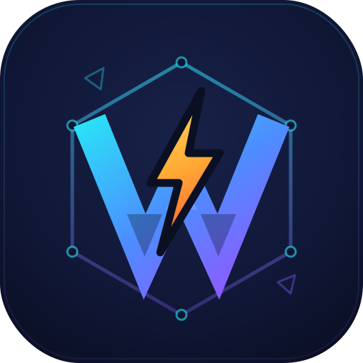

<p align="center">
  
</p>

# nitro_webgpu

**WebGPU for Flutter** — GPU compute and rendering from Dart with one API on
every platform, powered by [wgpu-native](https://github.com/gfx-rs/wgpu-native)
and bound through [Nitro](https://pub.dev/packages/nitro) FFI.

[](https://pub.dev/packages/nitro_webgpu)
[](https://github.com/Shreemanarjun/nitro_webgpu/actions/workflows/integration_test.yml)

One shared C++ core wraps the standard `webgpu.h` C ABI; shaders are written
once in WGSL (or GLSL) and run on Metal, Vulkan, and D3D12. The Dart API
uses typed descriptors with defaults, `Future`s instead of callbacks, and
deterministic `dispose()` with a GC-finalizer safety net. No `dart:ffi`
types in the public API.

## Demo

The example app: shader editor, Shadertoy player, GPU particles, the
showcase gallery, and GPU-state games.

https://github.com/user-attachments/assets/296912d1-95f7-43b9-92b3-cb751b9affae

https://github.com/user-attachments/assets/5e42166e-366e-43be-b508-ecf87a6c629d

## Getting started

Add the dependency:

```yaml
# pubspec.yaml
dependencies:
  nitro_webgpu: ^0.0.1
```

Or track the repository directly:

```yaml
# pubspec.yaml
dependencies:
  nitro_webgpu:
    git:
      url: https://github.com/Shreemanarjun/nitro_webgpu.git
```

Android, Windows, and Linux need nothing else — the first build downloads
the prebuilt wgpu-native binaries (sha256-pinned) automatically.

macOS and iOS need one command, run from your app directory (xcframework
assembly requires `xcodebuild`, which can't run inside the build):

```bash
dart run nitro_webgpu:setup
```

## One widget, one shader

`WebGpuShaderView` owns the device, uniforms, pipeline, and presentation;
you write a fragment shader:

```dart
import 'package:flutter/material.dart';
import 'package:nitro_webgpu/nitro_webgpu.dart';

void main() => runApp(MaterialApp(
      home: WebGpuShaderView(fragment: '''
@fragment
fn fs_main(@builtin(position) pos: vec4f) -> @location(0) vec4f {
  let uv = pos.xy / nw.resolution;
  let wave = sin(uv.x * 6.0 + nw.time) * cos(uv.y * 4.0 - nw.time * 0.7);
  return vec4f(0.1 + 0.5 * wave, 0.2 + uv.y * 0.5, 0.6 - 0.3 * wave, 1.0);
}
'''),
    ));
```

This is a complete app that animates at display rate on all five
platforms. The fragment sees Shadertoy-style built-ins: `nw.time`,
`nw.resolution`, `nw.mouse`, `nw.mouseDown`, and `nw.keys` (arrows/WASD).
The source can be swapped live, including hot reload; a compile error
keeps the last good frame running and surfaces through `onError`, a
custom `errorBuilder`, or the built-in overlay.
`language: ShaderViewLanguage.glsl` runs GLSL sources unchanged.

### Pick your level

| Level | You write | It handles |
|---|---|---|
| `WebGpuShaderView` | a fragment shader string | everything |
| `WebGpuBuilder` + `WebGpuView` | a per-frame callback recording passes | device boot, loading/error UI, frame pacing, presentation |
| Raw API (`Gpu.requestAdapter()` …) | everything | nothing — full WebGPU control |

The tiers compose: the shared `WebGpu.device()` behind `WebGpuBuilder` is
a normal `GpuDevice`, so raw compute and render code runs on it too. All
three widgets take `loadingBuilder`/`errorBuilder`, and none of them
rebuilds or allocates per frame.

### Controllers

Each widget pairs with a controller, in the `TextEditingController`
style:

| Controller | Pairs with | Gives you |
|---|---|---|
| `WebGpuViewController` | `WebGpuView` | `pause()` / `resume()`, `requestFrame()` (one frame while paused); stats: `frameCount`, `fps`, `elapsed`, `hasPresented`, `renderSize` |
| `WebGpuShaderViewController` | `WebGpuShaderView` | the same, plus `time` / `resetTime()`, `lastError` / `hasError`, and `setKeyLane(lane, down)` to drive `nw.keys` from on-screen touch buttons |
| `GpuInputs` | `WebGpuInputArea` | the polled input state below |

```dart
final shader = WebGpuShaderViewController();
WebGpuShaderView(fragment: src, controller: shader);
// later:
shader.pause();
shader.requestFrame();   // render one frame while paused
shader.resetTime();      // nw.time restarts at 0
```

Pausing mutes the ticker (no encode, present, or readback), and the
elapsed time handed to frames excludes the pause, so animations resume
where they stopped.

### Input

For interactive content, wrap a view in `WebGpuInputArea` and poll a
`GpuInputs` object from your frame callback: pointer position (also
normalized 0-1), buttons, scroll and movement deltas, held keys, and an
arrows/WASD `moveAxis` vector. Events are plain field writes — no
rebuilds:

```dart
final inputs = GpuInputs();
// ...
WebGpuInputArea(
  inputs: inputs,
  child: WebGpuView(device: device, onFrame: _frame),
)
// in _frame: inputs.moveAxis, inputs.uv, inputs.isKeyDown(...),
//            inputs.takeScroll(), inputs.takePointerDelta()
```

With a `GpuInputMap`, game code polls named actions instead of keys.
Bindings mix keys and mouse buttons; rebinding at runtime is swapping the
map:

```dart
// LogicalKeyboardKey is in package:flutter/services.dart,
// kPrimaryButton in package:flutter/gestures.dart.
final inputs = GpuInputs(
  map: GpuInputMap(
    actions: {
      'fire': GpuInputBinding(
          keys: {LogicalKeyboardKey.space}, buttons: kPrimaryButton),
    },
    axes: {
      'steer': GpuInputAxis(
        negative: GpuInputBinding(keys: {LogicalKeyboardKey.keyA}),
        positive: GpuInputBinding(keys: {LogicalKeyboardKey.keyD}),
      ),
    },
  ),
);
// in _frame: if (inputs.action('fire')) ...; x += inputs.axisValue('steer');
```

In `WebGpuShaderView`, the four `nw.keys` lanes default to arrows/WASD
and remap through `keyBindings:`.

## Full control in one file

The same wave with your own uniform layout, pipeline, and render pass;
`WebGpuBuilder` handles device boot and `WebGpuView` presentation.

```dart
import 'dart:typed_data';

import 'package:flutter/material.dart';
import 'package:nitro_webgpu/nitro_webgpu.dart';

const _shader = '''
struct Uniforms { time: f32, aspect: f32 };
@group(0) @binding(0) var<uniform> u: Uniforms;

@vertex
fn vs_main(@builtin(vertex_index) i: u32) -> @builtin(position) vec4f {
  // Fullscreen triangle, no vertex buffer needed.
  var p = array<vec2f, 3>(vec2f(-1.0, -3.0), vec2f(3.0, 1.0), vec2f(-1.0, 1.0));
  return vec4f(p[i], 0.0, 1.0);
}

@fragment
fn fs_main(@builtin(position) pos: vec4f) -> @location(0) vec4f {
  let uv = pos.xy / 600.0;
  let wave = sin(uv.x * 6.0 + u.time) * cos(uv.y * 4.0 - u.time * 0.7);
  return vec4f(0.1 + 0.5 * wave, 0.2 + uv.y * 0.5, 0.6 - 0.3 * wave, 1.0);
}
''';

void main() => runApp(const MaterialApp(home: WaveDemo()));

class WaveDemo extends StatefulWidget {
  const WaveDemo({super.key});
  @override
  State<WaveDemo> createState() => _WaveDemoState();
}

class _WaveDemoState extends State<WaveDemo> {
  GpuShaderModule? _module;
  GpuBuffer? _uniforms;
  GpuRenderPipeline? _pipeline;
  GpuBindGroup? _bind;

  Future<void> _frame(
      GpuDevice device, GpuRenderTarget target, Duration elapsed) async {
    // Created on the first frame, then reused.
    _module ??= await device.createShaderModule(_shader);
    _uniforms ??= device.createBuffer(
        size: 16, usage: GpuBufferUsage.uniform | GpuBufferUsage.copyDst);
    _pipeline ??= await device.createRenderPipeline(
        module: _module!, targetFormat: target.targetFormat);
    _bind ??= device.createBindGroup(
        layout: _pipeline!.getBindGroupLayout(0),
        entries: [GpuBufferBinding(binding: 0, buffer: _uniforms!)]);

    final t = elapsed.inMicroseconds / 1e6;
    device.queue.writeBuffer(
        _uniforms!,
        Float32List.fromList([t, target.width / target.height, 0, 0])
            .buffer
            .asUint8List());

    final encoder = device.createCommandEncoder();
    encoder.beginRenderPass(colorAttachments: [
      GpuColorAttachmentInfo(view: target.view),
    ])
      ..setPipeline(_pipeline!)
      ..setBindGroup(0, _bind!)
      ..draw(3)
      ..end();
    device.queue.submit([encoder.finish()]);
  }

  @override
  void dispose() {
    _bind?.dispose();
    _pipeline?.dispose();
    _uniforms?.dispose();
    _module?.dispose();
    // The shared device outlives this screen — nothing else to release.
    super.dispose();
  }

  @override
  Widget build(BuildContext context) {
    return Scaffold(
      body: WebGpuBuilder(
        builder: (context, device) => WebGpuView(
          device: device,
          onFrame: (target, elapsed) => _frame(device, target, elapsed),
        ),
      ),
    );
  }
}
```

The example app in this repo has more: a live WGSL/GLSL shader editor, a
Shadertoy-compatible player with multi-pass buffers, GPU particles, an
18-scene showcase gallery, and two GPU-state games (Breakout and an
endless racer), plus the four integration-test suites that run all of it
in CI.

## What the plugin does

### Adapter and device

```dart
final adapter = await Gpu.requestAdapter();          // real hardware preferred
print('${adapter.info.device} on ${adapter.backendType.name}');

final device = await adapter.requestDevice(
  requireTimestampQueries: adapter.supportsTimestampQueries,
  requiredFeatures: {GpuFeature.textureCompressionBc},
  requiredLimits: GpuRequiredLimits(maxColorAttachmentBytesPerSample: 40),
);
```

`requestAdapter` enumerates every adapter and picks real hardware over
software rasterizers, preferring Vulkan/Metal/D3D12 over GL when both exist.
`powerPreference` selects integrated vs discrete GPUs.

### Buffers

```dart
final storage = device.createBuffer(
    size: bytes, usage: GpuBufferUsage.storage | GpuBufferUsage.copySrc);
device.queue.writeBuffer(storage, data);             // zero-copy upload

final staging = device.createBuffer(
    size: bytes, usage: GpuBufferUsage.mapRead | GpuBufferUsage.copyDst);
final result = await staging.mapRead();              // GPU → Dart readback
```

### Shaders: WGSL and GLSL

```dart
final module = await device.createShaderModule(wgslSource);

final fs = await device.createShaderModuleGlsl(glslSource,
    stage: GpuShaderStage.fragment);                 // Shadertoy content as-is
```

Modules and pipelines compile on a background worker thread, so
hot-swapping a live shader doesn't stall the UI isolate.

### Pipelines and passes

```dart
final compute = await device.createComputePipeline(module: module);

final render = await device.createRenderPipeline(
  module: module,                  // vertex + fragment (or fragmentModule:)
  targetFormat: GpuTextureFormat.rgba8Unorm,
  vertexBuffers: [
    GpuVertexLayout(arrayStride: 16, attributes: [
      GpuVertexAttr(
          format: GpuVertexFormat.float32x4, offset: 0, shaderLocation: 0),
    ]),
  ],
);

final encoder = device.createCommandEncoder();
encoder.beginComputePass()
  ..setPipeline(compute)
  ..setBindGroup(0, bind)
  ..dispatchWorkgroups(n)
  ..end();
device.queue.submit([encoder.finish()]);
```

Bind groups come from `pipeline.getBindGroupLayout(0)` (auto layout) or
explicit `createBindGroupLayout` / `createPipelineLayout`. Render passes
support every draw variant (indexed, instanced, indirect), full
depth/stencil/blend state, MSAA + resolve, multiple render targets, render
bundles, scissor/viewport, and occlusion + timestamp queries.

### Textures and samplers

```dart
device.queue.writeTexture(texture, pixels);          // stride derived
device.queue.writeTexture(bc1Texture, bc1Blocks);    // block math automatic
GpuTextureFormat.bc1RgbaUnorm.byteLengthFor(512, 512);
```

2D/3D/cube textures, storage textures, comparison samplers, mipmaps, and
compressed formats (BC1–7, ETC2/EAC, ASTC) with block-aligned strides
computed for you. `copyTextureToBuffer` handles 256-byte row alignment and
mip-sized extents.

### Rendering to the screen

```dart
WebGpuView(
  device: device,
  renderScale: 1.0,                // dynamic resolution knob
  onFrame: (target, elapsed) {
    // record + submit a render pass into target.view
    // create pipelines against target.targetFormat
  },
)
```

Frames are paced drop-latest (a slow frame skips instead of queueing) and
the first frame is gated so views don't flash black.

### Feature detection

```dart
if (await device.supportsCompute()) { ... }
if (await device.supportsVertexStorage()) { ... }
```

Downlevel GL adapters lack some capabilities (see limitations); the
probes are cached.

### GPU timing

With `requireTimestampQueries`, timestamp query sets on compute and render
passes report exact per-pass GPU milliseconds.

### API index

| Area | Entry points |
|---|---|
| Instance | `Gpu.requestAdapter`, `Gpu.ensureInitialized(backends:)`, `Gpu.version` |
| Adapter | `info`, `backendType`, `features`, `limits`, `supportsTimestampQueries`, `requestDevice` |
| Device | `queue`, `limits`, `features`, `dispose`, `supportsCompute()`, `supportsVertexStorage()` |
| Buffers | `createBuffer`, `queue.writeBuffer`, `mapRead`, `mapWrite`, `copyBufferToBuffer` |
| Shaders | `createShaderModule` (WGSL), `createShaderModuleGlsl` (GLSL) |
| Pipelines | `createComputePipeline`, `createRenderPipeline` (vertex buffers, depth/stencil, blend, MSAA, multi-target), `getBindGroupLayout` |
| Binding | `createBindGroup`, `createBindGroupLayout`, `createPipelineLayout`, dynamic offsets |
| Passes | `beginComputePass`, `beginRenderPass` (indexed/instanced/indirect draws, scissor, viewport, occlusion queries), render bundles |
| Textures | `createTexture` (2D/3D/cube, mips, MSAA, storage), `createView`, `createSampler` (incl. comparison), `writeTexture` (auto stride, compressed), `copyTextureToBuffer`, `copyTextureToTexture` |
| Timing | `createTimestampQuerySet`, pass-level `timestampWrites`, `queue.timestampPeriod` |
| Errors | typed checked creates, `pushErrorScope`/`popErrorScope`, `onUncapturedError`, `onLost` |
| Widgets — foundation | `WebGpu.device()` (shared app-lifetime device), `WebGpuBuilder(builder:, loadingBuilder:, errorBuilder:)` |
| Widgets — presentation | `WebGpuView(device:, onFrame:, renderScale:, filterQuality:, loadingBuilder:, errorBuilder:, controller:)` + `WebGpuViewController` (pause/resume/requestFrame) |
| Widgets — interaction | `GpuInputs` (polled state: mouse, keys, scroll/pointer deltas, `moveAxis`), `GpuInputMap`/`GpuInputBinding`/`GpuInputAxis` (named actions incl. mouse buttons), `WebGpuInputArea(inputs:, child:)` |
| Widgets — effects | `WebGpuShaderView(fragment:, language:, renderScale:, onError:, errorBuilder:, keyBindings:, controller:)` + `WebGpuShaderViewController` (pause/resetTime/lastError) — built-ins incl. `nw.mouse`/`nw.keys` |

## Supported platforms

| Platform | Presentation path | Status |
|---|---|---|
| macOS | GPU→GPU Metal blit into IOSurface | ✅ CI-verified on Metal |
| iOS | GPU→GPU Metal blit into IOSurface | ✅ Simulator CI-verified; physical device pending signing |
| Android (Vulkan) | Zero-copy `WGPUSurface` swapchain | ✅ CI emulator + physical 120 Hz device |
| Android (GL-only) | CPU-readback fallback into the Flutter texture | ✅ Verified on GLES-translator emulator |
| Windows | DXGI shared-texture composition (CPU upload for now) | ✅ CI-verified on D3D12 WARP |
| Linux | CPU readback (dmabuf fast path planned) | ✅ CI-verified on Vulkan lavapipe |
| Web | `navigator.gpu` via JS interop | 📐 designed for, not yet built |

## How it compares

Against the other ways to reach the GPU from Flutter:

| | **nitro_webgpu** | [flutter_gpu](https://api.flutter.dev/flutter/flutter_gpu/) (official) | [gpux](https://github.com/dartgfx/gpux) | [minigpu](https://pub.dev/packages/minigpu) | `FragmentProgram` |
|---|---|---|---|---|---|
| API model | Standard WebGPU (compute + render) | Custom low-level API over Impeller | WebGPU-style facade | Compute-only (gpu.cpp) | Fragment shaders only |
| Compute shaders | ✅ full (storage textures, indirect, timestamps) | ⚠️ limited/experimental | ✅ | ✅ (its focus) | ❌ |
| Rendering to a widget | ✅ `WebGpuView` — zero-copy swapchain (Android Vulkan), Metal blit (Apple), DXGI shared texture (Windows) | ✅ (native to the engine) | ⚠️ varies | ❌ | ✅ (paint-time) |
| Shader language | WGSL and GLSL at runtime (Shadertoy-compatible) | GLSL, offline-bundled | WGSL | WGSL | GLSL, offline-bundled |
| Engine coupling | None — stable Flutter, any renderer | Requires Impeller, experimental, master channel recommended | None | None | None |
| Backend | wgpu-native and Dawn, switchable | Impeller | wgpu | Dawn | Skia/Impeller |
| Downlevel hardware | GL fallback + feature probes (GLES-only Android still renders) | n/a | ⚠️ | ⚠️ | ✅ |
| Verification | 134-test integration matrix × 5 platforms × 2 backends in CI, plus real-device runs | Flutter CI | ⚠️ | ⚠️ | Flutter CI |

If you only need a fragment-shader effect, `FragmentProgram` is built in
and simpler. If you want the engine team's own experimental low-level
renderer and can ride the master channel, look at flutter_gpu. This
plugin is for a full GPU API (compute + rendering, queries, compressed
textures) on stable Flutter.

Moving from one of these? [docs/MIGRATION.md](docs/MIGRATION.md) has
concept maps and before/after code for each.

## Two backends, one API

The plugin runs on both production WebGPU implementations —
[wgpu-native](https://github.com/gfx-rs/wgpu-native) (Rust, used by
Firefox) and [Dawn](https://dawn.googlesource.com/dawn) (C++, used by
Chrome). The same Dart code runs on either; the integration-test matrix
passes on both.

### Switching backends

wgpu-native is the default. Dawn is a per-platform build switch with no
Dart changes:

```bash
# Fetch prebuilt Dawn from this repo's dawn-v* releases…
./scripts/fetch_dawn.sh --version dawn-v1 --targets macos-aarch64,android-aarch64
# …or build/stage it locally from a Dawn checkout:
./scripts/stage_dawn_macos.sh      # + stage_dawn_ios.sh / stage_dawn_android.sh

# Flip the switch (per platform, content-tracked so builds can't go stale):
./scripts/set_backend_macos.sh dawn     # macOS  (SwiftPM manifest toggle)
./scripts/set_backend_ios.sh dawn       # iOS
./scripts/set_backend_android.sh dawn   # Android/Windows/Linux (CMake marker)

# …and back:
./scripts/set_backend_macos.sh wgpu
```

Reasons to pick Dawn: Chrome-lineage validation messages, its
`SharedTextureMemory` zero-copy interop (used for IOSurface and DXGI
shared-handle presentation), or matching the engine your web build runs
on. wgpu-native stays the default because GLSL ingestion is built in
(Dawn needs a staged glslang) and its GL backend covers GLES-only Android
devices that Dawn leaves without an adapter.

Known behavioral differences (all gated in the test suites): Dawn doesn't
reify limits requested below the default, its pass-boundary timestamps
can read equal on trivial passes, `Gpu.version` reports `0.0.0.0`, and
one Adreno-specific indirect-args quirk is tracked for upstream.
Everything else behaves identically.

## Limitations

- **GL-backend devices are downlevel.** Without Vulkan (old Android
  hardware, GLES-translator emulators), wgpu's GL backend may lack compute
  shaders and vertex-stage storage buffers — feature-detect with
  `supportsCompute()` / `supportsVertexStorage()`. Emulator capabilities can
  even vary between launches; enable Vulkan (`-gpu swiftshader_indirect`, or
  AVD Graphics: Software) for the full, stable feature set.
- **GL-backend Android presents via CPU readback.** wgpu's GL backend cannot
  create an EGL swapchain on a Flutter `SurfaceProducer` window, so the
  presenter automatically switches to the desktop-style readback ring and
  CPU-blits frames into the window (~60 fps at 1080p on an emulator, but not
  zero-copy). Vulkan devices keep the zero-copy swapchain.
- **Desktop Linux defaults to the Vulkan backend only**: wgpu's GL probe
  races the Flutter GTK engine's EGL context. Pass `GpuBackend.gl` in
  `Gpu.ensureInitialized(backends:)` if you need GL.
- **Desktop frames still cross the CPU once.** Windows composites a shared
  DXGI texture (`GpuSurfaceTexture`) — the engine samples it directly with
  zero raster-thread upload — but filling it is one `UpdateSubresource`
  from the readback ring, and Linux presents via the pixel-buffer texture.
  Fully zero-copy needs wgpu-native to expose D3D12/Vulkan handle
  accessors like the Metal trio it already ships; the C ABI has none today
  (upstream request drafted in `docs/upstream/`). When they land, the CPU
  fill becomes a GPU copy with no other changes.
- **No indirect draws/dispatches on the iOS simulator.** The simulator's
  Metal (Apple2-sim family) lacks indirect execution and wgpu aborts at
  submit — the plugin refuses the encode with a catchable error instead.
  Real iOS devices support indirect fully.
- **Web backend is not built yet**; the API deliberately avoids `dart:ffi`
  types so a `navigator.gpu` implementation can share the same surface.
- Upstream wgpu-native has a few unimplemented stubs; the plugin calls
  none of them.

## Error handling

Everything surfaces as a typed Dart error — never a native crash:

```dart
try {
  await device.createShaderModule(brokenWgsl);
} on GpuValidationException catch (e) {
  print(e.message);        // naga's full diagnostics, with source spans
}
```

- **Checked creates**: shader modules and pipelines validate on creation and
  throw `GpuValidationException` carrying the complete naga/WGSL compiler
  message.
- **Error scopes**: `device.pushErrorScope(GpuErrorFilter.validation)` /
  `await device.popErrorScope()` capture errors from any span of commands
  (filters: `validation`, `outOfMemory`, `internal`).
- **Uncaptured errors**: `device.onUncapturedError` is a broadcast stream of
  everything not caught by a scope.
- **Device loss**: `device.onLost` is a stream that reports the reason
  (`GpuDeviceLostReason`) if the device dies.
- **Native panic guards**: known wgpu-native abort paths (unbalanced
  `popErrorScope`, surface configure on GL, invalid mid-frame surface drops)
  are guarded in the plugin so mistakes stay catchable Dart exceptions
  instead of killing the process.
- **Presentation failures degrade visibly, not fatally**: if a presenter
  cannot be created, `WebGpuView` renders an explanatory message and the app
  keeps running.
- **Argument validation**: byte-length and alignment mistakes (e.g.
  `writeBuffer` sizes not multiple-of-4) throw `ArgumentError` before
  touching the GPU.
